# Smart flowerpot
The aim of the project is to create a self-sufficient and ECO-friendly planter for growing vegetables.

A photo of the current prototype model can be found below.

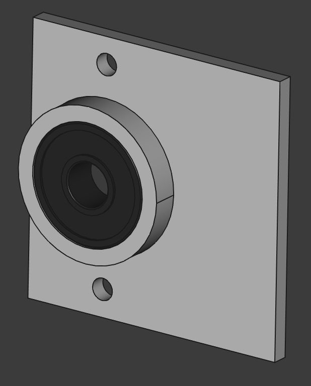

## Outdated model photos
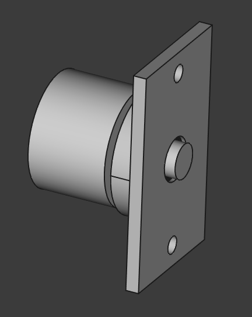

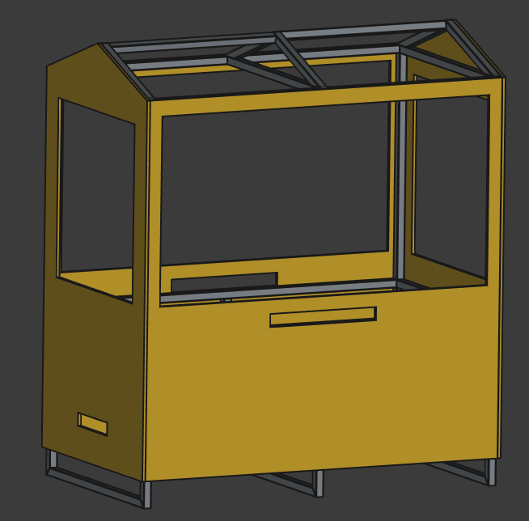

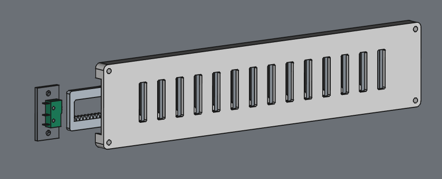

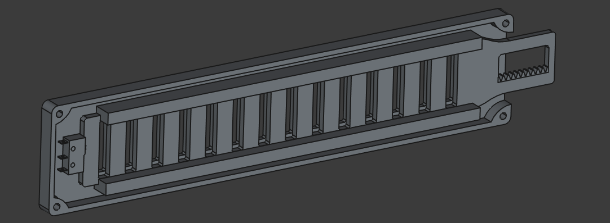

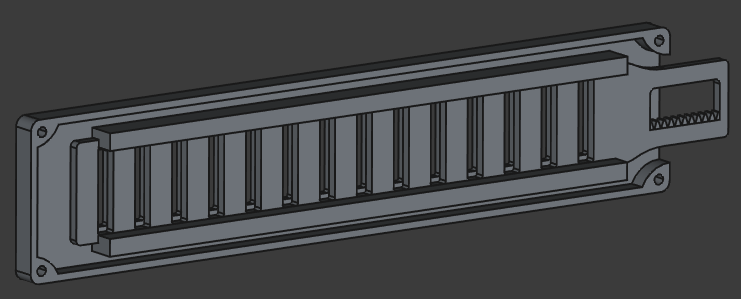

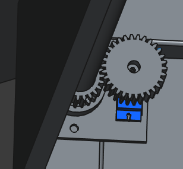

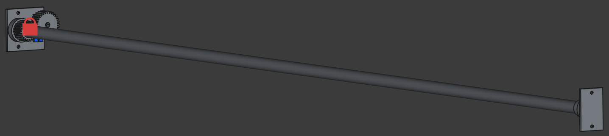

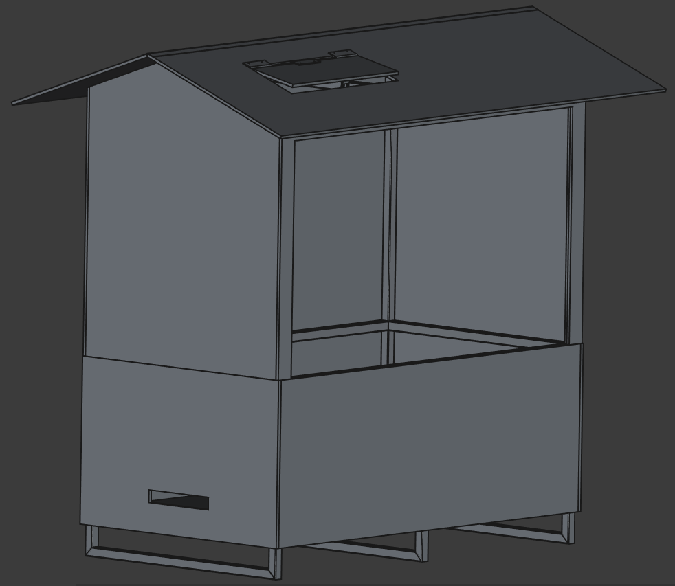

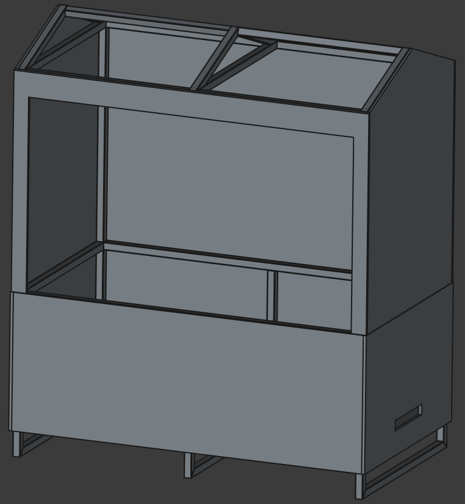

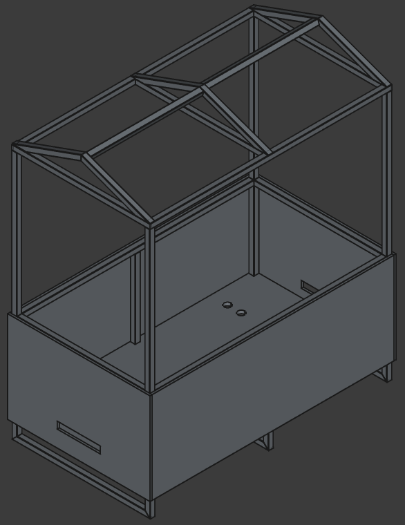

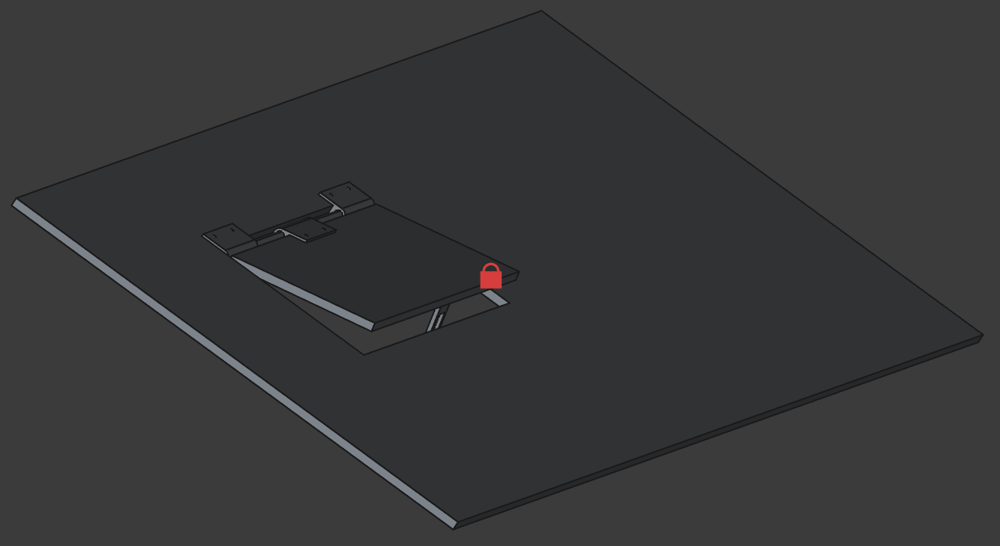

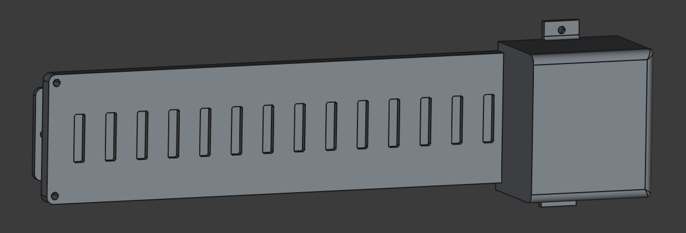

###### Created by warezoid with the love of freedom and numbers.
