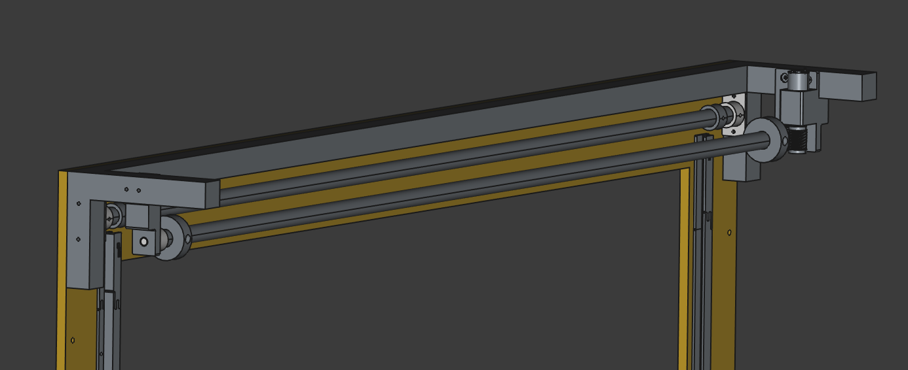
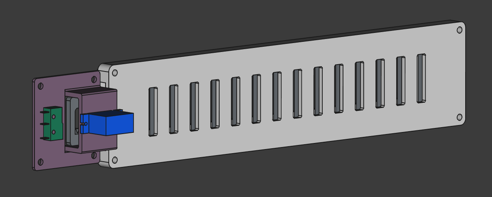
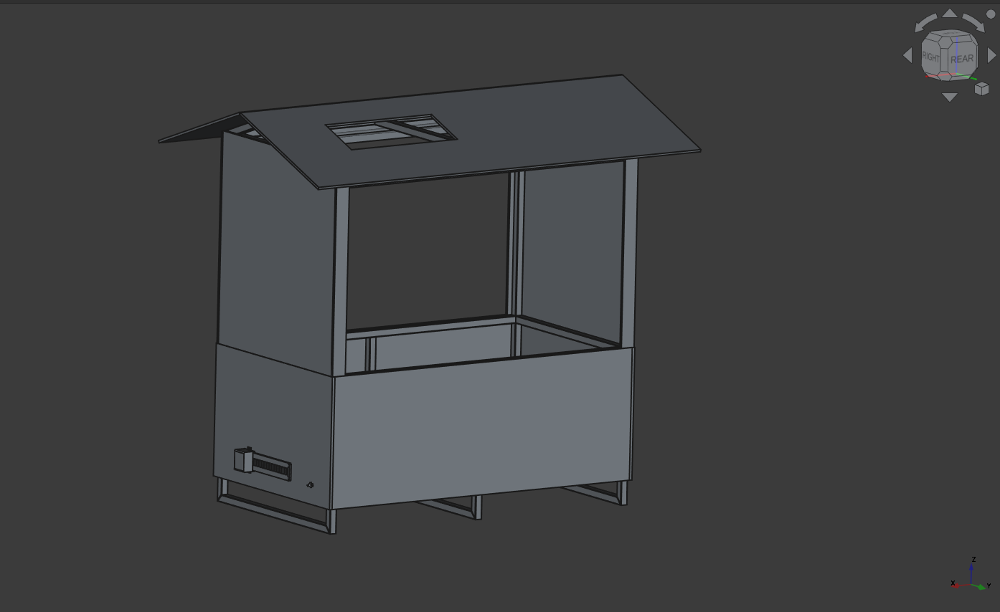

# Smart flowerpot
The aim of the project is to create a self-sufficient and ECO-friendly planter for growing vegetables.

## Project roadmap
1. Hardware completation - finish hardware assemblies and subassemblies.
    - Drainage vent - finished.
    - Roulette system - working on.
    - Flower vent system
2. Sensors completation - solve sensor placement and data gathering.
3. User interface - create user interface with graphs, controls, logs, ...

## Outdated model photos
CAD of roulette system. 

CAD of drainage vent system.

CAD of older smart flower assembly.

###### Created by warezoid with the love of freedom and numbers.